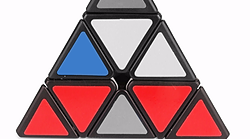
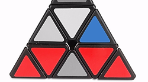
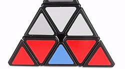
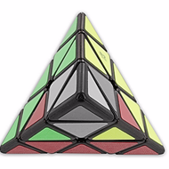

# Pyraminx
Short hand notes based on [Kewbz UK](https://www.kewbz.co.uk/blogs/solutions/how-to-solve-a-pyraminx) article.

## Notation


## The Cross (ish)
* Spin the tips to line up with centre pieces
* Pick a colour (most guides use blue), and twist until all centre pieces are the same
* Twist remaining centre piece in place

## Edge pieces
* Blue side face down
* Hold one colour facing you (eg red).
* Rotate until red/blue edge piece visible on F

|  |  |  |
| :---: | :---: | :---: |
| U' L' U L | U R U' R' | R U R'   (then case 1)

## OLL (ish)
* Blue side face down
* Rotate until one edge is correctly orientated. Place this edge at back.

|  |
| :---: |
| L R' L' R U R U' R' |

## PLL (ish)
* Align edges correctly.
* Either need to shift top centre pieces clockwise or anti-clockwise

|  | |
| :---: | :---: |
| Clockwise | R U R' U R U R' |
| Anti Clockwise | L' U' L U' L' U' L |

# Alternate Patterns
## Inner Colours
Alternating inner colours
```
U R L' U' R L B U' L' B u l r b
```
